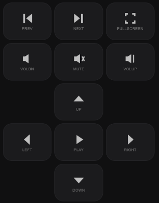

# Web Remote

[![github][badge-github]][link-github]
[![license][badge-license]][link-license]
[![version][badge-version]][link-crate]
[![rust-edition][badge-rust]][link-rust]
[![dependencies][badge-deps]][link-cargo]
[![tests][badge-tests]][link-ci]

[badge-github]: https://img.shields.io/badge/github-simon3z/web--remote-6f57b0.svg?logo=github
[badge-license]: https://img.shields.io/badge/license-Apache_2.0-blue.svg
[badge-version]: https://img.shields.io/badge/version-0.1.0-ff8000.svg
[badge-rust]: https://img.shields.io/badge/rust-edition_2021-steelblue.svg
[badge-deps]: https://img.shields.io/badge/dependencies-13-green.svg
[badge-tests]: https://img.shields.io/badge/tests-28_passing-brightgreen.svg
[link-github]: https://github.com/simon3z/web-remote
[link-license]: LICENSE
[link-crate]: Cargo.toml
[link-cargo]: Cargo.toml
[link-rust]: https://www.rust-lang.org
[link-ci]: #quality-gate

> Remote multimedia keyboard for your Linux desktop, driven from a phone's browser.

A single-binary Rust tool that serves a token-guarded web UI over the local
network so a phone can send media keys (play/pause, stop, next, prev, volume,
mute, arrows, fullscreen) to the local Linux host. No phone app, no Bluetooth,
no login — just scan a QR code and press buttons.

## Quick start

```bash
cargo build --release

# No sudo — works on a stock GNOME/Wayland install (default sink):
./target/release/web-remote --input wayland

# Any compositor, needs root (drops back to your user after opening uinput):
sudo ./target/release/web-remote --input evdev
```

A QR code is printed to the terminal. Scan it with your phone to open the UI —
no app, no login, same Wi‑Fi.

## Sinks

| `--input` | How it works | Needs root? |
|-----------|--------------|-------------|
| `wayland` (default) | `enigo` via the Wayland virtual-keyboard protocol | No |
| `evdev` | `uinput` virtual keyboard (open → drop privileges → serve) | Yes (`sudo`) |
| `null` | no-op, for testing / headless dev | No |

## CLI flags

| Flag | Default | Description |
|------|---------|-------------|
| `--input <method>` | `wayland` | Sink: `wayland`, `evdev`, or `null` |
| `--bind <addr>` | `0.0.0.0` | Listen address |
| `--port <port>` | `40443` | Listen port (fixed, not random) |
| `--http` | off | Serve plain HTTP (debugging only; default is HTTPS) |
| `--host <ip>` | auto-detected | Host IP to print in the QR/URL |
| `--user <name\|uid>` | from `SUDO_UID` | evdev sink: who to drop to after opening uinput |

## Security model

- **Token is the auth.** A 32-byte random secret (43-char URL-safe base64,
  ~232 bits) is generated fresh each start and embedded in the URL path
  (`/p/<token>/...`). No cookie, no session, no rotation. The token dies with
  the process — killing the tool invalidates it and unregisters the keyboard.
- **HTTPS by default.** Self-signed cert via `rcgen` (in-memory, nothing on
  disk). The phone accepts the warning once. `--http` is explicit opt-in for
  debugging.
- **Media keys only.** The API accepts a closed set of twelve wire keys
  (`play`, `stop`, `next`, `prev`, `volup`, `voldn`, `mute`, `up`, `down`,
  `left`, `right`, `fullscreen`). There is no code path to emit a generic
  typing key — a leaked secret cannot type into the desktop.
- **Anything without a valid token gets a 404.** No distinguishable "exists"
  vs "not found"; the service doesn't leak that it's running.
- **QR is terminal-only.** The QR code is printed to the operator's terminal,
  not served over HTTP. A `GET /` QR route would let any LAN device pull the
  token, defeating the secret-URL model.

### Tradeoff (acknowledged)

With the evdev sink, the web server runs as the original invoking user after
the privilege drop. The only root-equivalent thing left is the inherited
uinput fd, which can only emit key events. With the wayland sink, the server
runs as your normal user with no root window at all. Either way, **R4
(media-keys-only) is the security boundary**, not the uid.

## Architecture

- **Language:** Rust, single binary, no external runtime.
- **Key injection:** pluggable `Sink` trait (`emit(key, hold_ms)`). Two
  real backends: `evdev` (uinput, root, any compositor) and `wayland` (enigo
  virtual-keyboard + X11 fallback, no root, GNOME). A `null` sink logs keys
  for testing.
- **Web server:** axum (tokio-native), token-in-path auth, self-signed TLS by
  default. Routes: `GET /p/<token>` (UI), `POST /p/<token>/key` (emit),
  `GET /p/<token>/ping` (health). Everything else → 404.
- **UI:** hand-written HTML/CSS/JS, compiled in with `include_str!`. No
  framework, no build step, no external assets. Eleven buttons in a flat 5×3
  grid: transport row (prev/next/fullscreen), volume row (vol-down/mute/vol-up),
  arrow cross with play/pause at center. Stop is long-press on play/pause
  (hold > 600 ms → stop; tap → play/pause).

  <p align="center"></p>
- **QR code:** `qrcode` crate, rendered as ANSI half-blocks to the terminal.
  Encodes the full `https://<host>:<port>/p/<token>` URL.
- **Privilege drop (evdev only):** open `/dev/uinput` as root → register device
  → `setresuid`/`setresgid` to the invoking user (from `SUDO_UID`, or `--user`,
  or `nobody`) → serve. The uinput fd is inherited across the drop.

### Tech stack

| Concern | Choice |
|---|---|
| Language | Rust |
| Key injection | [`evdev`](https://docs.rs/evdev) + [`enigo`](https://docs.rs/enigo) |
| Web framework | [`axum`](https://docs.rs/axum) |
| TLS (default) | [`rcgen`](https://docs.rs/rcgen) self-signed, in-memory |
| QR | [`qrcode`](https://docs.rs/qrcode) |
| Privilege drop | [`nix`](https://docs.rs/nix) `setresuid`/`setresgid` |
| UI | hand-written HTML/CSS/JS, `include_str!` |

## Building

```bash
cargo build --release
```

No system dependencies beyond a standard Fedora userspace. The `evdev` sink
needs `/dev/uinput` (root or `input` group). The `wayland` sink needs a
Wayland compositor that implements the virtual-keyboard protocol (GNOME does).

## Quality gate

```bash
./ci.sh
```

Runs: `cargo fmt --check`, `cargo clippy -D warnings`, `cargo doc`,
`cargo package`, `cargo test`, UI HTML structure check, and cognitive
complexity threshold.

## Manual tests (run on a real machine)

Items that can't be verified in the dev container:

- **Wayland sink (no sudo):** press each of the 11 keys on the phone; verify
  the active GNOME session reacts (player toggles, volume changes, mute,
  arrows, fullscreen). Stop via long-press on play/pause (hold > 600 ms).
- **Volume long-press:** hold a volume key for ~2 s; volume should ramp up
  (kernel auto-repeat). On the wayland sink this is best-effort; the evdev
  sink ramps for real.
- **Phone UX (iOS Safari + Android Chrome):** tap works, hold-fill grows on
  volume keys, press-glow + haptic fire, failed request shows error + re-
  surfaced hint. Long-press → stop works on iPhone.
- **Evdev sink under sudo:** keys still arrive *and* the process shows non-root
  after the drop (`cat /proc/self/status | grep uid`).
- **Evdev sink as non-root:** clean error + non-zero exit, no hang, hint to
  `--input wayland`.

## Deferred / future work

- `--cert <file> --key <file>`: user-provided cert/key (R10, not yet
  implemented).
- `host.rs::bind_addr` uses `.expect()` on user-supplied `--bind`: a malformed
  address panics instead of erroring. Low value vs churn — revisit when more
  bind-related flags land.
- No integration test for privilege drop (needs root); left to manual testing.
- Dependency pinning: `axum` is pinned at 0.8.3 in the lockfile; later 0.8.x
  releases fixed a `serve_static` path-traversal CVE that we don't touch, but
  any future `cargo update` should land deliberately on ≥ 0.8.10.
